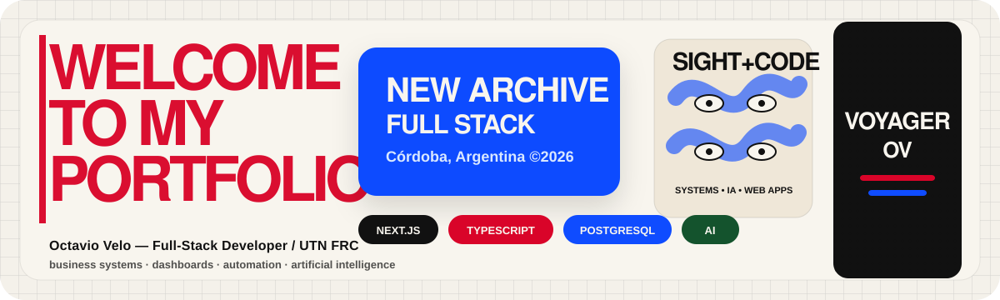

  

  

    
    
  

# 👋 Hola, soy Octavio Velo

Soy estudiante de **Ingeniería en Sistemas de Información en UTN FRC** y desarrollador **Full-Stack** enfocado en construir productos web reales para operaciones de negocio: gestión de pedidos, stock, caja, catálogos públicos, reportes, dashboards e integraciones con IA.

Trabajo principalmente con **Next.js, React, TypeScript, PostgreSQL, Prisma, Firebase Auth, Tailwind CSS y shadcn/ui**. También tengo experiencia con **Python, Django, Angular, Electron y AWS** para proyectos backend, automatización y aplicaciones de escritorio.

Mi foco hoy está en convertir problemas operativos concretos en software usable: menos planillas, menos procesos manuales y más información accionable para tomar decisiones.

---

## 🚀 Qué estoy construyendo

- **Sistemas de gestión para comercios reales**: pedidos, inventario, caja, egresos, ingresos, clientes y reportes.
- **Aplicaciones SaaS / multi-tenant**: separación por negocio, roles, permisos y flujos por tipo de usuario.
- **Productos con IA aplicada**: análisis de documentos, OCR, asistencia para workflows y automatización de tareas.
- **Dashboards operativos**: métricas de negocio, stock crítico, ventas, productos más vendidos y actividad diaria.

---

## 🧰 Stack principal

### Frontend

### Backend, datos e infraestructura

---

## 📫 Contacto

- **Email:** [octavio.velo2024@gmail.com](mailto:octavio.velo2024@gmail.com)
- **GitHub:** [github.com/Voyager-Ov](https://github.com/Voyager-Ov)
