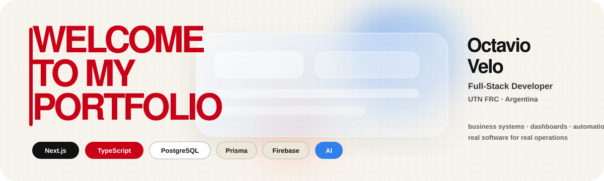

  

  

    
    
  

# 👋 Hola, soy Octavio Velo

Soy estudiante de **Ingeniería en Sistemas de Información en UTN FRC** y desarrollador **Full-Stack** enfocado en construir productos web reales para operaciones de negocio.

---

## 🧰 Stack principal

Next.js · React · TypeScript · PostgreSQL · Prisma · Firebase · IA

---

## 📫 Contacto

- **Email:** [octavio.velo2024@gmail.com](mailto:octavio.velo2024@gmail.com)
- **GitHub:** [github.com/Voyager-Ov](https://github.com/Voyager-Ov)
